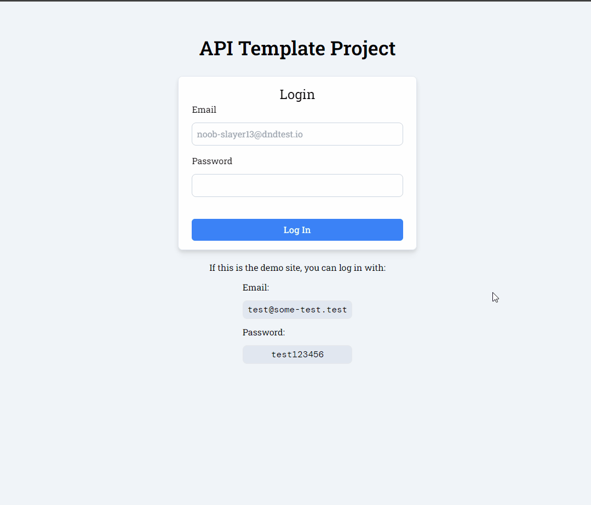

# API Template Project

This template is meant to get you up and running with a basic API using Nextjs really fast.
Some of the features include:

- Prisma is set up for interacting with the database, including migrations and more.
- Login/Logout + Seeding of first user.
- Creating/deleting API keys that 3rd parties can use to access your API.
- Wrapper functions for Nextjs API handlers to protect your endpoints with less boilerplate.
- Built-in support for Swagger to display API documentation.
- Uses DaisyUI + Tailwind CSS for styling and React Icons for icons.

This project was made to make it easier to create API services quickly.
So it can be used for microservice/service architecture setups or just for making a public API.

It could also be used as a baseline for creating a custom headless CMS.



## Getting Started

Set up environment variables for Prisma in `prisma/.env` (see `prisma/.env.example`).

Then set up environment variables for the rest of the app in `.env.local` (see `.env.local.example`).

Run the following command to create and seed the database along with creating type safe Prisma types:

```bash
npm run prisma:setup
# or
yarn prisma:setup
```

Then run the development server:

```bash
npm run dev
# or
yarn dev
```

Open [http://localhost:3000](http://localhost:3000) with your browser to see the result.

You can start modifying the files.

[API routes](https://nextjs.org/docs/api-routes/introduction) can be accessed on `http://localhost:3000/api/...`.

The `pages/api` directory is mapped to `/api/*`. Files in this directory are treated as [API routes](https://nextjs.org/docs/api-routes/introduction) instead of React pages.

## Learn More

To learn more about Next.js, take a look at the following resources:

- [Next.js Documentation](https://nextjs.org/docs) - learn about Next.js features and API.
- [Learn Next.js](https://nextjs.org/learn) - an interactive Next.js tutorial.

You can check out [the Next.js GitHub repository](https://github.com/vercel/next.js/) - your feedback and contributions are welcome!
